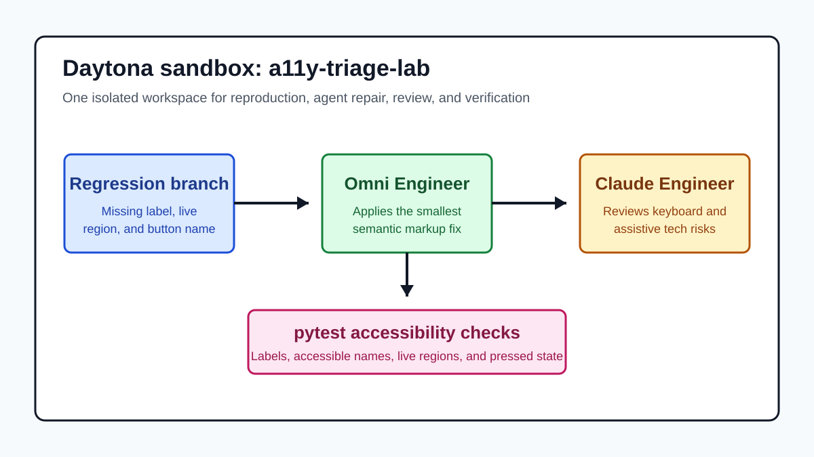

# Rehearse Accessibility Triage in Daytona

# Introduction

Accessibility bugs are easy to miss when a change still looks correct in a
browser. A filter form can keep its visual layout while losing a label, an
icon-only reset button can lose its accessible name, and a dynamic status line
can stop announcing updates to assistive technology. That kind of
[accessibility regression](../definitions/20260604_definition_accessibility_regression.md)
often survives casual review because the interface still appears usable to the
developer who changed it.

AI engineering tools can help, but they need a tight workflow. In this guide,
[Omni Engineer](https://github.com/Doriandarko/omni-engineer) acts as the
repair agent, [Claude Engineer](https://github.com/Doriandarko/claude-engineer)
acts as the accessibility reviewer, and a [Daytona
sandbox](https://www.daytona.io/docs/en/sandboxes/) keeps the exercise
isolated. The goal is not to ask an agent to "make accessibility better." The
goal is to give two agents one reproducible failure, one focused patch, one
review pass, and one executable test suite.

You will use a small Flask demo project with a deliberately broken branch:

- [Daytona Accessibility Regression Demo](https://github.com/skrtdev/daytona-a11y-regression-demo)

The `regression` branch fails tests for four common issues: a search input
without a real label, a reset button without an accessible name, a status
message without a polite live region, and filter buttons without grouped
pressed state. The `main` branch is the fixed reference implementation.

## TL;DR

- Add secret-free Dev Container definitions to Omni Engineer and Claude
  Engineer so each repository has a portable Python workspace.
- Create one Daytona sandbox with API keys supplied as environment variables.
- Clone the demo project and check out its `regression` branch.
- Ask Omni Engineer to make the smallest semantic markup fix that turns the
  failing tests green.
- Ask Claude Engineer to review the exact diff for keyboard, screen reader, and
  regression-test gaps.
- Run `pytest -q` and `git diff --check` before treating the repair as ready.

## Step 1: Prepare the Agent Workspaces

The companion Dev Container contributions for this workflow are:

| Repository | Purpose | Pull Request |
| --- | --- | --- |
| Omni Engineer | Python 3.11 workspace, dependency install, and `OPENROUTER_API_KEY` passthrough | [Doriandarko/omni-engineer#45](https://github.com/Doriandarko/omni-engineer/pull/45) |
| Claude Engineer | Python 3.11 workspace, dependency install, `ANTHROPIC_API_KEY` passthrough, optional `E2B_API_KEY`, and port `5000` forwarding | [Doriandarko/claude-engineer#270](https://github.com/Doriandarko/claude-engineer/pull/270) |

The files are intentionally small. They install each repository's existing
`requirements.txt` and read keys from the local environment:

```json
{
  "image": "mcr.microsoft.com/devcontainers/python:3.11",
  "postCreateCommand": "python -m pip install --upgrade pip && python -m pip install -r requirements.txt",
  "remoteUser": "vscode"
}
```

The full Omni Engineer version passes `OPENROUTER_API_KEY`. The Claude Engineer
version passes `ANTHROPIC_API_KEY`, optionally passes `E2B_API_KEY`, and
forwards port `5000` for the web UI. Neither file includes a `.env` file or
hard-codes a secret.

Daytona's current CLI creates and executes commands in sandboxes. The
walkthrough below uses the documented `daytona create`, `daytona exec`, and
`daytona ssh` flow instead of assuming that Daytona automatically interprets a
repository's `devcontainer.json`. The Dev Container files are still useful
because they make each agent repository portable for editors and other
compatible development environments.

## Step 2: Create a Daytona Sandbox

Install and authenticate the Daytona CLI before starting. The CLI reference
documents `daytona create --env` for environment variables and `daytona exec
--cwd` for command execution in a selected working directory.

Export your keys locally:

```bash
export OPENROUTER_API_KEY="your-openrouter-key"
export ANTHROPIC_API_KEY="your-anthropic-key"
```

Create an isolated sandbox:

```bash
daytona create \
  --name a11y-triage-lab \
  --env OPENROUTER_API_KEY="$OPENROUTER_API_KEY" \
  --env ANTHROPIC_API_KEY="$ANTHROPIC_API_KEY"
```

> **Note:** Keep real keys outside Git. If you create the sandbox before
> exporting the variables, recreate the sandbox with the correct `--env` flags
> rather than committing a local `.env` file.

Clone the two agents and the demo project:

```bash
daytona exec a11y-triage-lab \
  -- git clone https://github.com/skrtdev/omni-engineer.git /home/daytona/omni-engineer

daytona exec a11y-triage-lab \
  -- git clone https://github.com/skrtdev/claude-engineer.git /home/daytona/claude-engineer

daytona exec a11y-triage-lab \
  -- git clone https://github.com/skrtdev/daytona-a11y-regression-demo.git /home/daytona/daytona-a11y-regression-demo
```

Check out the intentionally broken branch:

```bash
daytona exec a11y-triage-lab \
  --cwd /home/daytona/daytona-a11y-regression-demo \
  -- git checkout regression
```

Create a separate virtual environment for each repository:

```bash
daytona exec a11y-triage-lab \
  --cwd /home/daytona/omni-engineer \
  -- sh -lc "python -m venv .venv && .venv/bin/python -m pip install -r requirements.txt"

daytona exec a11y-triage-lab \
  --cwd /home/daytona/claude-engineer \
  -- sh -lc "python -m venv .venv && .venv/bin/python -m pip install -r requirements.txt"

daytona exec a11y-triage-lab \
  --cwd /home/daytona/daytona-a11y-regression-demo \
  -- sh -lc "python -m venv .venv && .venv/bin/python -m pip install -r requirements.txt"
```



The single sandbox keeps the work honest. Omni Engineer sees the failing files,
Claude Engineer reviews the same patch, and the tests run in the same
filesystem instead of in a pasted transcript.

## Step 3: Reproduce the Regression First

Run the tests before asking any agent to change code:

```bash
daytona exec a11y-triage-lab \
  --cwd /home/daytona/daytona-a11y-regression-demo \
  -- .venv/bin/python -m pytest -q
```

The `regression` branch should fail four tests:

| Failing Check | What It Means |
| --- | --- |
| `test_search_input_has_visible_label` | The search input is visually described but not associated with a real `<label>` |
| `test_reset_button_has_accessible_name` | The icon-only reset button has no accessible name |
| `test_filter_status_is_polite_live_region` | The status text will not be announced when it changes |
| `test_filter_controls_are_grouped_with_pressed_state` | The filter buttons do not expose grouped state to assistive technology |

This step matters. Reproduction gives the agents a measurable problem and gives
you a baseline. Without it, an agent may produce a broad rewrite that sounds
helpful but does not prove anything about the original bug.

## Step 4: Ask Omni Engineer for the Smallest Fix

Open a shell in the sandbox:

```bash
daytona ssh a11y-triage-lab
```

Start Omni Engineer:

```bash
cd /home/daytona/omni-engineer
.venv/bin/python main.py
```

Add the demo files to context:

```text
/add ../daytona-a11y-regression-demo/templates/index.html
/add ../daytona-a11y-regression-demo/tests/test_accessibility.py
```

Then give Omni Engineer a narrow repair request:

```text
Repair the accessibility regression in
/home/daytona/daytona-a11y-regression-demo.

Acceptance criteria:
1. Keep the existing Flask route and visible UI copy.
2. Associate the search input with a real visible label.
3. Give the icon-only reset button an accessible name.
4. Restore a polite live region for the filter status message.
5. Group the issue-state filter buttons and expose aria-pressed state.
6. Make the existing pytest accessibility tests pass.
7. Show the diff before treating the fix as complete.

Only change templates/index.html unless the tests prove another file must
change.
```

The key phrase is "only change `templates/index.html`." Accessibility fixes can
tempt an agent into redesigning the component, renaming tests, or deleting
assertions. A bounded prompt keeps the repair focused on semantics.

After Omni Engineer proposes the patch, run the tests:

```bash
daytona exec a11y-triage-lab \
  --cwd /home/daytona/daytona-a11y-regression-demo \
  -- .venv/bin/python -m pytest -q
```

The expected passing state is:

```text
4 passed
```

If the tests still fail, feed the exact failure back into Omni Engineer and ask
for the smallest follow-up patch.

## Step 5: Use Claude Engineer as the Reviewer

Once the tests pass, use Claude Engineer to review the exact diff. Start the
CLI or web interface. The CLI keeps the workflow terminal-first:

```bash
cd /home/daytona/claude-engineer
.venv/bin/python ce3.py
```

Ask for an accessibility review, not a rewrite:

```text
Review the accessibility regression fix in
/home/daytona/daytona-a11y-regression-demo.

Inspect templates/index.html, tests/test_accessibility.py, and the git diff.
Focus on whether the fix preserves keyboard access, visible labels,
accessible names, live-region behavior, grouped control state, and test
coverage. Do not rewrite the UI unless you find a concrete regression.
If there is a gap, explain it first and propose the smallest patch.
```

This is where the two-agent pattern pays off. Omni Engineer is biased toward
making the failure disappear. Claude Engineer is biased toward asking whether
the disappearance is meaningful. That difference catches issues such as:

- A hidden label that passes a test but makes the visual UI less clear.
- A reset button that has an accessible name but removes the visible affordance.
- A live region that exists but no longer contains the status message.
- Filter buttons that expose `aria-pressed` but no longer sit inside a named
  group.
- Tests that were changed to match the broken implementation.

If Claude Engineer recommends a patch, apply it and rerun the same tests. Do
not accept a review comment as proof until the repository verifies it.

## Step 6: Confirm and Preserve the Evidence

Run the final checks:

```bash
daytona exec a11y-triage-lab \
  --cwd /home/daytona/daytona-a11y-regression-demo \
  -- git diff --check

daytona exec a11y-triage-lab \
  --cwd /home/daytona/daytona-a11y-regression-demo \
  -- .venv/bin/python -m pytest -q
```

Inspect the final markup:

```bash
daytona exec a11y-triage-lab \
  --cwd /home/daytona/daytona-a11y-regression-demo \
  -- sed -n '1,120p' templates/index.html
```

The fixed markup should include:

```html
<label for="issue-search">Search issues</label>
<input id="issue-search" name="q" type="search" autocomplete="off">

<div role="group" aria-label="Issue state filters">
  <button type="button" aria-pressed="true">All</button>
</div>

<button type="reset" aria-label="Reset filters">x</button>
<p id="filter-status" role="status" aria-live="polite">Showing all issues.</p>
```

You do not need to ship this exact formatting. You do need to preserve the
semantics: a real label, an accessible name for the icon-only control, a named
group with pressed state, and a polite live region.

## Troubleshooting

**Problem: The agent changes the tests instead of the markup.**

Ask it to revert the test edits and repair only `templates/index.html`. The
tests are the contract for this exercise.

**Problem: The agent adds `aria-label` to the search input instead of restoring
the visible label.**

Reject that patch for this specific UI. A visible label helps more users and is
already part of the intended design.

**Problem: Claude Engineer suggests a complete component rewrite.**

Ask for the smallest patch that resolves a concrete accessibility or test
coverage gap. Broad rewrites make regressions harder to review.

**Problem: Daytona commands cannot find the repository path.**

Run `daytona exec a11y-triage-lab -- ls /home/daytona` and confirm that the
clone commands used the same directory names as the guide.

**Problem: An API key is unavailable inside the sandbox.**

Recreate the sandbox with `--env OPENROUTER_API_KEY=...` and
`--env ANTHROPIC_API_KEY=...`. Do not commit real keys into either agent repo.

## Conclusion

Accessibility triage works best when the problem is reproducible and the fix is
small. Daytona gives the agents an isolated workspace. Omni Engineer repairs
the failing semantics. Claude Engineer reviews the exact patch. The test suite
proves whether the label, button name, live region, and grouped filter state
survived the change.

That pattern scales beyond this demo. Any agent-assisted accessibility task can
use the same shape: reproduce first, patch narrowly, review separately, and
verify with executable checks before trusting the result.

## References

- [Daytona Sandboxes](https://www.daytona.io/docs/en/sandboxes/)
- [Daytona CLI Reference](https://www.daytona.io/docs/en/tools/cli/)
- [Daytona Getting Started](https://www.daytona.io/docs/en/getting-started/)
- [Dev Container Specification](https://containers.dev/)
- [Omni Engineer Repository](https://github.com/Doriandarko/omni-engineer)
- [Claude Engineer Repository](https://github.com/Doriandarko/claude-engineer)
- [Daytona Accessibility Regression Demo](https://github.com/skrtdev/daytona-a11y-regression-demo)
